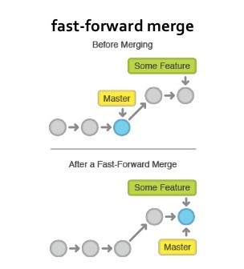

# Intro to Git & GitHub Workshop
---
## Lesson 1 - Git on Your Machine Locally


This is an introductory workshop to Git, created by 3DC. This Readme contains the lesson content for this workshop, including sample snippets.

1. [What is Git?](#)
2. [What is the difference between Git and GitHub?](#)
5. [Why should you learn Git?](#)
6. [Basic Shell Commands](#)
7. [Creating your first Git Repository](#)
8. [Checking the status of your Git Repository](#)
9. [Adding files to your Git Repository](#)
10. [The Staging Area](#)
15. [`git commit` - Take Snapshot of Your Work](#)
16. [`git log` - Viewing Your Commit History](#)
17. [`git rm` - Remove files from a Git Repository](#)
17. [`.gitignore` - Tell `git` to ignore certain files or folders](#)
17. [`git branch` - Branching](#)
17. [`git merge` - Merges](#)
17. [Git GUI](#)


## What is Git?

**`Git`** is distributed version control software. Version control is a way to save changes over time without overwriting previous versions. Being distributed means that every developer working with a Git repository has a copy of that entire repository - every commit, every branch, every file. If you're used to working with centralised version control systems, this is a big difference!

## What is the difference between Git and GitHub?

#### TLDR:
- **`Git`** is a version control software that manages your local git repositories.
- **`GitHub`** is an online hosting service for your `git` repositories.

#### Long version:

<div style="text-align:center"></div>

- **`Git`** is open-source software that helps you manage code versions, keep track of file changes. You can interact with `git` using CLI (Command Line Interface), meaning you type in git commands in your shell/ terminals. Alternatively, you can choose to use a third-party GUI (Graphical User Interface) from [here](https://git-scm.com/downloads/guis/).

<div style="text-align:center"></div>

- **`GitHub`** is an online platform developed by a company and then acquired by Microsoft in 2018. GitHub, the platform, provides free hosting service for git repositories, which usually contains code or text files. It also enables collaboration on projects, since the repository is hosted on the cloud, teams can collaborate on the project repository from different locations. GitHub is an online service that is built around git, making git more convenient and powerful for programmers especially teams.

## Why should you learn Git?

- **`Git`** is essential for software development, any software engineering position would expect you to know how to use Git by default.
- **`Git`** also can be used for your personal projects and/or school projects to avoid this:

<div style="text-align:center"></div>


## Basic Shell Commands

Launch your Terminal / Shell on your computer:


| Windows | MacOS |
| :---: | :---:|
|  |  |


- `ls` for List
    - `ls -a` for List All
    - `ls -la` for List All with details
- `cd` for Change Directory
- `mkdir` for Make Directory
- `touch` to create a new file
- `pwd` for Print/present Working Directory

## Creating your first Git Repository - One Person Starting a New Repository Locally

>Recall a Git repository is a virtual Git collection, containing different versions of your project files. This git repository can reside inside a local folder inside your computer, and it can also be linked to a remote repository on somewhere like Github. (This concept is somewhat similar to a file-hosting website like Dropbox)

```bash
mkdir my_project
cd my_project

git init
```

You should see a message acknowledging the creation of the git repository.

<div style="text-align:center"></div>


### What Does `git init` Do?

`git init` turns any directory into a Git repository.

- Two Scenarios:
    1. Start a fresh project locally
    2. Make an existing local project into a `git` repository.


- `git init` is one way to start a new project with Git. To start a repository, use either `git init` or `git clone` - not both. We will learn `git clone` in the second session of this workshop.

- To initialise a repository, `Git` creates a hidden directory called `.git`. That directory stores all of the objects and refs that `Git` uses and creates as a part of your project's history. This hidden `.git` directory is what separates a regular directory from a `Git` repository.

<div style="text-align:center"></div>

## Checking the status of your Git Repository

To check the status of your `git` repository (as a sanity check or whatever), you can use the following command. This command also checks that the `git` repository has been initialised.

```bash
git status
```

You should see something like this:

<div style="text-align:center"></div>


## Adding files to your Git Repository

### create some dummy files

create a new file called `hello_1.txt`
```bash
touch hello_1.txt
```

create a new file called `hello_2.txt`
```bash
touch hello_2.txt
```

create a new file called `hello_3.txt`
```bash
touch hello_3.txt
```

- Run `git status` You will find the files listed under **untracked files**.
    <div style="text-align:center"></div>
- While the files are already in the folder (**working directory**), they have not yet been "added" to the **repository** per say, you need to **manually add** these files into the repository using git commands.

### `git add <file>`

```bash
git add hello_1.txt
```

- `git status`
    <div style="text-align:center"></div>


## The Staging Area

<div style="text-align:center"></div>

Concepts:

- Any changes you made inside a `git` repository have to be **staged** first before **committing**.
- It is a way to let `git` know what are the files/changes you want `git` to keep track of.
- The **staging area** can be thought of as the intermediary between your `folder (working directory)` and the `git repository`. Files in the staging area are the files that will be captured in the snapshot in the next commit.

Commands:

- `git add <filename>` stages your changes on `<filename>`.
- `git add --all` or `git add -A` stages all files, including new, modified, and deleted files, including files in the current directory and in higher directories that still belong to the same git repository.
- `git rm --cached <filename>` **unstages** a file, move it from `staging area` to `untracked`.


## `git commit` - Take Snapshot of Your Work
In a Git project timeline, commits are like the core building blocks! They can be thought of as milestones along the timeline of a Git project. Just like keyframes in an animation. You should make new commits often, based around logical units of change. Over time, commits should tell a story of the history of your repository and how it came to be the way that it currently is. Commits include lots of metadata in addition to the contents and message, like the author, timestamp, and more.

- *commit*
```
git commit
```
This starts the commit process, but since it doesn't include a `-m` flag for the message, your default text editor will be opened for you to create the commit message. If you haven't configured anything, there's a good chance this will be `Vim`. (To get out, press esc, then `:wq`, and then Enter.)

- *commit with one-line commit message*
```bash
git commit -m "descriptive commit message"
```
- *one-line commit message example*
```bash
git commit -m "update the README.md with link to contributing guide"
```

- *combine git add and git commit*
```bash
git commit -am "descriptive commit message"
```
In addition to including the commit message, this option allows you to skip the staging phase. The addition of `-a` will automatically stage any files that are already being tracked by Git (changes to files that you've committed before).


## `git log` - Viewing Your Commit History

<div style="text-align:center"></div>

The `git log` command shows you all the committed snapshots. It is used to list and filter the project history and to search for any particular changes.

The log output can be personalised differently by allowing you to filter commits and to display them in an entirely user-defined format

- *show complete commit history*
    ```bash
    git log
    ```
    this command allows you to view the entire commit history. It uses space for scrolling and q for exiting if the log output takes up multiple screens

- *show compact commit log with oneline per commit*
    ```bash
    git log --oneline
    ```
    this command allows you to fit each commit into a single line, which comes in handy when you would like to get an overview of the project history.

- *show git graph*
    ```bash
    git log --oneline --graph
    ```

    <div style="text-align:center"></div>


- these are just some of the most commonly used commands, to see the full list of available formatting options use the `git help log` command to see the man page for the Git Log tool. Alternatively you could view the [online documentation](https://git-scm.com/book/en/v2/Git-Basics-Viewing-the-Commit-History) here!

## `git rm` - Remove files from a Git Repository

- *delete a file*
```bash
rm <filename>
```

- *delete a file and stage this change*
```bash
git rm <filename>
```


- *delete a directory and stage this change*
```bash
git rm -r <directory>
```

## `.gitignore` - Tell `git` to ignore certain files or folders

- *create a dummy file called `credentials.txt`*
```bash
touch credentials.txt
```

- *check git status*
```bash
git status
```

- *create a file called `.gitignore`*
```bash
touch .gitignore
```

- *append a line of text to `.gitignore`*
```bash
echo "credentials.txt" >> .gitignore
```

- *display the content of the file*
```bash
cat .gitignore
```

- *commit this `.gitignore` file*
```bash
git add .gitignore
git commit -m  'Add .gitignore'
```

- *check status. `credentials.txt` exists in working directory but not tracked by `git`*
```bash
ls
git status
```

### How to ignore an already tracked file

- *append a line to the `.gitignore`*
```bash
echo "*.txt" >> .gitignore
```
`*` means anything, so `*.txt` represents any file with a `.txt` extension.

- *commit this change*
```bash
git add .gitignore
git commit -m  'Add .gitignore'
```

- *check files being tracked in git repository*
```bash
git ls-tree -r master
```

- *remove everything from git but not working directory*
```bash
git rm -r --cached .
```

- *stage everything*
```bash
git add .
```

- *commit everything*
```bash
git commit -m 'Update'
```

- *check files being tracked in git repository*
```bash
git ls-tree -r master
```

## `git branch` - Branching

Git branches are essentially a pointer to a snapshot of your changes! It is good practice to spawn a branch every time you want to add a new feature or fix a bug to encapsulate your changes. By doing so the chances of unstable code being merged into the main code base will become lesser.

<div style="text-align:center"></div>

In this image, the repository contains two isolated lines of development of a little feature and a longer running feature. You can thus visualize how through branching developers can not only work on the two features simulataneouly but can also be rest assured that the master branch is kept free from possibly unstable code.

Do note that the master branch is the name of the default branch. In this picture the central line of development depicts the master branch.

How this works is that Git stores a branch as a reference to a commit. In other words, a branch represents the tip of a series of commits and is not a container of for commits.


- *lists all the branches in your repository*
```bash
git branch
```

- *creates a new branch named `<branch>`*
```bash
git branch <branch>
```

- *move to the `<branch>`*
```bash
git checkout <branch>
```

- *delete a specified branch*
```bash
git branch -d <branch>
```

### `git checkout`

- `git checkout` operates upon three distinct entities: `files`, `commits`, and `branches`.
- `git checkout <BRANCH NAME>` switches to another existing branch.
- `git checkout -b <NEW BRANCH NAME>` creates a new branch and switches to it simultaneously.
- `git checkout <COMMIT HASH STRING>`

## `git merge` - Merges

The ```git merge``` command is essentially used to take two independent lines of development created by ```git branch``` and integrate them into a single branch. Let us take a closer look on how this works:

The ```git merge``` commit will combine multiple sequences of commits into one unified history. We will now focus on the merging of two branches even though this concept can be extended to include more than two branches. What ```git merge``` does is it takes two commit pointers (Generally the tip) and finds a common base commit between them so that it can create a new "merge commit" that combines the changes of each queued merge commit sequence.

<div style="text-align:center"></div>
<div style="text-align:center"></div>

Here is a pictorial representation of how this is done!

#### Preparing to Merge

There are a couple things you need to take care of to ensure that the merge goes smoothly:

1) Confirming the receiving branch: Execute ```git status``` to ensure that the``` HEAD``` is pointed to the correct merge-receiving branch
2) Making sure that the receiving branch and the merging branch are up-to-date with the latest remote changes

#### Merging

Once you are ready to merge, execute the ``` git merge <branchname>``` command to merge ```<branchname>``` to the receiving branch

#### Fast Forward Merge

This occurs when there is a linear path from the current branch tip to the target branch. In such a situation what Git needs to do is to "Fast Forward" the current branch tip to the target branch. What this essentially does is combining the histories of the two branches.

<div style="text-align:center"></div>

Here is a pictorial depiction of how a fast forward merge works

#### 3-Way Merge

When there exists no linear path between the two branches (The branches are merged) then the only option the Git has is to combine them via a 3-Way merge. 3-Way merges use a dedicated commit to tie together the two histories. The nomenclature comes from the fact that Git uses three commits to generate the merge commit: the two branch tips and their common ancestor.

The merging diagram we presented to you earlier shows how 3-Way merging is carried out!

#### Resolving Merge Conflicts

Sometimes two developers will change the same line of code in two different ways and in such a case, Git can't tell which version is correct. Since that is something that only a developer can tell, merge conflicts must be resolved manually.

If this happens you should see something like this in your screen

```
Auto-merging <file>
CONFLICT (content): Merge conflict in <file>
Automatic merge failed; fix conflicts and then commit the result.
```
Once you open the open the file in which there is a conflict you should see something like this:

```
<<<<<<< HEAD
This is an edit on the master branch
=======
This is an edit on the <branch-name> branch
>>>>>>> <branch-name>

```

The "<<" character denotes the current branch's edits and the "==" sign denotes the end of the first section. The second section is where the edits are from the attempted merge, and it starts with the "==" signs and ends with the ">>" signs.

Since you are the developer, you get to decide what stays and what goes. Make your edits as required and then close the file. Once you are done with this follow the directions to add the files and then commit.

You can find advanced information on Git merging and merge-conflict resolution [right here](https://git-scm.com/book/en/v2/Git-Tools-Advanced-Merging).


## Git GUI

### Shell Integration

- For macOS / Linux / WSL User
    - [Z shell](http://zsh.sourceforge.net/)
    - [Oh My Zsh](https://github.com/ohmyzsh/ohmyzsh)
    - [Powerlevel 10k](https://github.com/romkatv/powerlevel10k)

### Editor Integration

- Any mainstream IDE/ Text Editor would support some `git` plugins.
    - VS code
    - Atom
    - VIM
    - ...

## `git config` Customisation

- [prettier-git-logs](https://medium.com/@lucaspenzeymoog/prettier-git-logs-one-graph-at-a-time-d3790a753e6b)
