# Git with Github

1. [Creating a GitHub account](#creating-a-github-account)
2. [Route 1: Uploading an exisiting repository on local machine to Github](#route-1-uploading-an-exisiting-repository-on-local-machine-to-github)
   1. [Creating a Repository on GitHub](#creating-a-repository-on-github)
   2. [Adding Collaborators to your personal repository](#adding-collaborators-to-your-personal-repository)
   3. [Remote Repositories](#remote-repositories)
      1. [Adding a Remote](#adding-a-remote)
      2. [Pushing to GitHub Remote](#pushing-to-github-remote)
3. [Route 2: Cloning a Github Repository onto your local machine](#route-2-cloning-a-github-repository-onto-your-local-machine)
   1. [Forking a repository](#forking-a-repository)
   2. [Creating a new branch on Github](#creating-a-new-branch-on-github)
   3. [Cloning the repository](#cloning-the-repository)
   4. [Example: Making changes to the project](#example-making-changes-to-the-project)
   5. [Commiting your changes and pushing them onto Github](#commiting-your-changes-and-pushing-them-onto-github)
4. [Pull Requests](#pull-requests)
5. [Hosting your Website on Github Pages](#hosting-your-website-on-github-pages)

## Creating a GitHub account

Step 1: Go to [this page](https://github.com/join) in any web browser

Step 2: Enter all your personal details: your desired username, email Id and Password and hit "Sign up for GitHub"
<div style="text-align:center">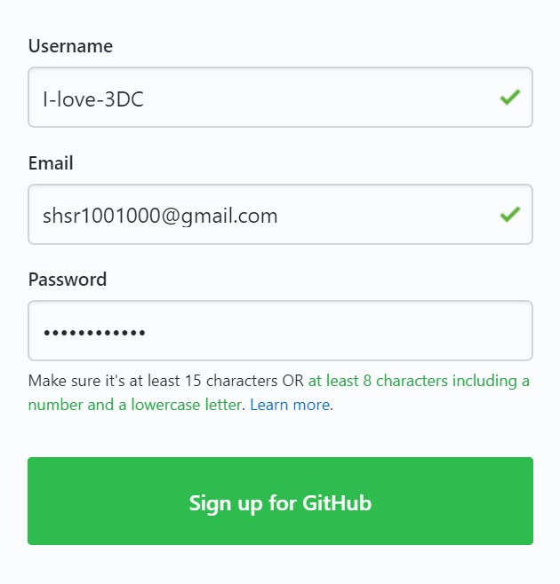</div>

Step 3: Click the Complete any CAPTCHA puzzle you are asked to complete and hit "Join a Free Plan"
<div style="text-align:center">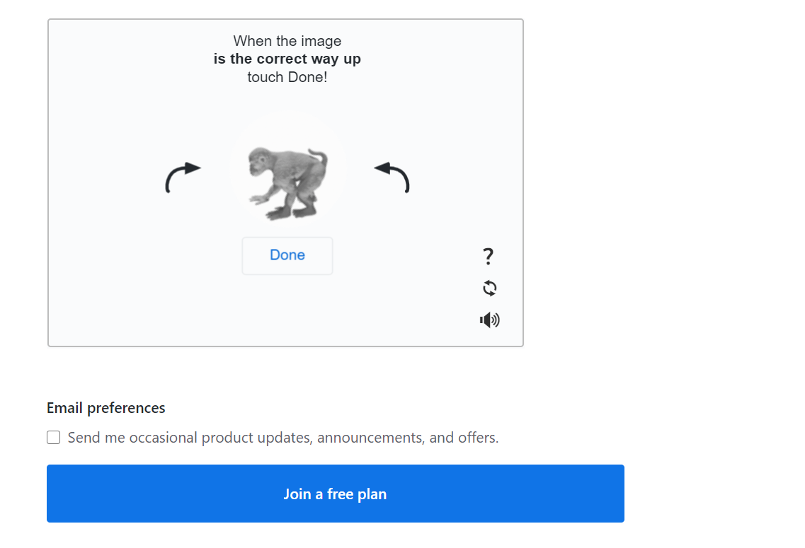</div>


Step 4: Select all your preferences 

Step 5: Verify your email address 

Step 6: Skip any other step for now

## Route 1: Uploading an exisiting repository on local machine to Github

This route is applicable when you have created a local Git repository on your machine, and want to upload it online onto Github, perhaps to collaborate with your teammates. We shall be using the local git repsitory we created last session as an example.

(If you have attended the last lesson, you may skip these steps) Please refer to to [The Day 0 Notes](0_Install_Git.md) to install Git. Then follow the steps below to create a Git respoitory on your local computer containing these files.

1. Create a git repository inside an empty folder with `git init`
2. Download sample project files for a website from here: https://github.com/kaypohleb/js-teaching
3. Unzip the files into the empty folder with the git repository
4. `git add -a` to add all new files to the staging area
5. `git commit -m 'Initial Commit'` to commit the new files into the git repsitory.

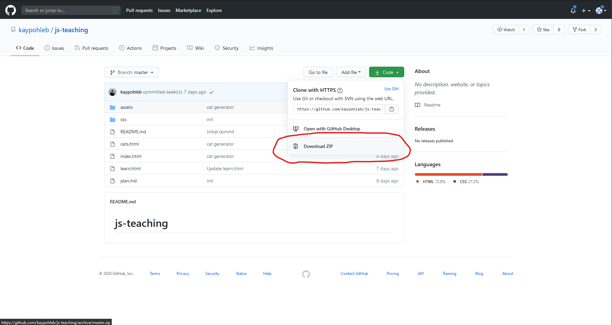

### Creating a Repository on GitHub

Step 1: On the upper right corner of any page on the GitHub website, click the "+" icon and then click the option that says "New Repository

<div style="text-align:center">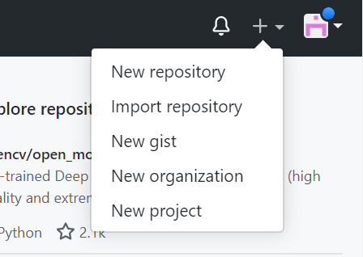</div>

Step 2: Type in the name and the optional description for the new repository 

Step 3: Choose whether you would like to make this repository a public or a private one. Let us choose the private option for now

Step 4: You can choose to initialise your repository with a README file, which is essentially a document that describes your project. Let us go ahead and do this for now!

<div style="text-align:center"></div>

### Adding Collaborators to your personal repository

You can add your friends/project-mates as your collaborators on GitHub just by knowing their username, full-name or email ID

Step 1: In your repository's main page, click on the settings page

<div style="text-align:center"></div>


Step 3: On the panel to your left, click on the "Manage Access" option 

<div style="text-align:center">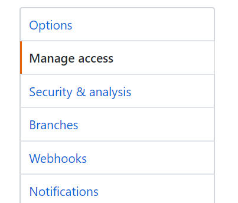</div>


Step 4: In this page, scroll to the bottom and click on the "Invite a Collaborator" option. You are now prompted to enter either the username, email ID or the full-name of your soon to be project collaborator. 

You can either add your friends as collaborators or any of us. Our usernames are: slimechips, MarkHershey, SHSR2001. 

Once you are done finding that person click on "Select a collaborator above"

<div style="text-align:center">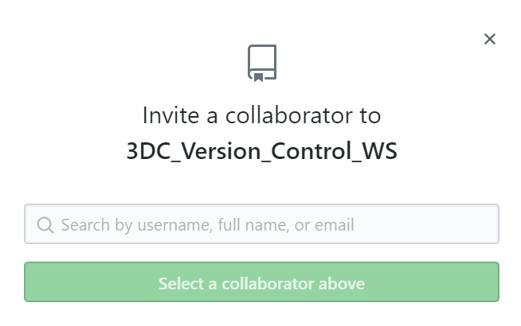</div>

### Remote Repositories 

Remote repositories come into the picture in situations where you need to share data with your team-mates. The way it works is that first, al modifications are made and committed locally as you have seen before! Once you are ready to share your changes with your team mates you can choose to upload these changes to a remote repository. The key takeaway here is that remote repositories act as a means for sharing and exchanging code between developers and not actually working on files.

A noteworthy point here would be that while remote repositories do not actually differ much from local ones, a key differentiating factor between the two is the fact that a local repo has a working copy asscociated with it (a directory where some version of your project's files is checked out for you to work with), while remote repositories do not have any such working directories. 

Given below is a pictorial representation of the local-remote workflow

<div style="text-align:center"></div>

We will now see how you can add a new remote to your Git repo

#### Adding a Remote

To add a new remote, we make use of the ```git remote add``` command on the terminal, in the directory where your repository is stored. The command takes in two arguments:
  1) A unique remote name
  2) A remote URL, which is found in the "Source" sub-tab of your GitHub repo (On the GitHub website). If you do not know where this is refer to the screenshot below 
  
  <div style="text-align:center">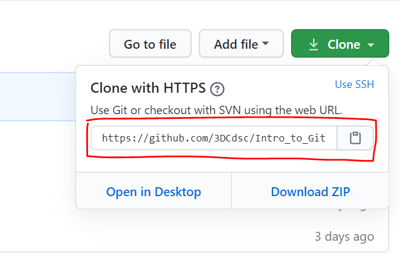</div>
  
it should be executed in the following format:
  
```bash
git add <remote name> <remote URL>
```
  
Once this is done you could use the ``` git remote -v``` command to verify your remote
  
If you have done all of this successfully it should look something like this:
  


#### Pushing to GitHub Remote

In order to ensure a complete collaborative workflow, in addition to ```git add``` and ```git commit``` a third ```git push``` command is necessary! This is used to send all committed changes to remote repositories for collaboration. Thus team members get access to a set of all saved changes.

```bash
git push
```

This is the most basic command to push your changes from your current branch onto corresponding branch on the remote repository.

``` bash
git push <remote> <branch>
```
This command allows you to push the specified branch into the specified remote.

```bash
git push <remote> --force
```
This command allows you to force a push when you need to replace the remote history with your local history. Force pushing is not considered to be a good practice and thus we advise you against using this command unless you are **absolutely** sure of what you are doing. 

```bash
git push <remote> --all
```
This command allows you to push all your local brnahces into the specified remote

```bash
git push <remote> --tags
```
This command allows you to send all your local tags to the remote repository. Tags are not automatically pushed when you push a branch or use the ```--all``` option. 

These are just some of the most commonly used commands, to see the full list of available formatting options use the ```git help push``` command to see the man page for the Git Push tool. Alternatively you could view the [online documentation](https://git-scm.com/docs/git-push) here!

## Route 2: Cloning a Github Repository onto your local machine

Imagine your friend, or someone else has created an online repository on Github, with some prexisting files in it already. This route will explain how you might collaborate with your friend to work the existing repository, **OR** create your own copy of the repository and work on it yourself.

### Forking a repository

This step is applicable if you want to create your own copy of the repository, without affecting the original repository. Note that if you already have edit rights to the repository and want to edit it directly, you do not need to do this step. Let us first begin by understanding what forking is.

<div style="text-align:center">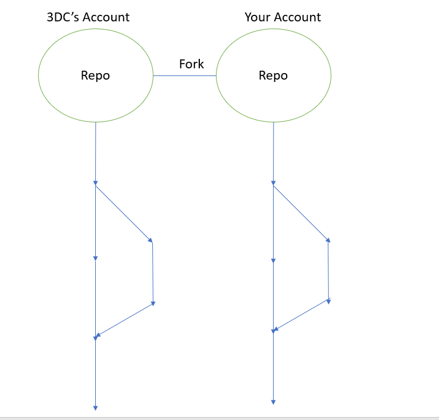</div>

Assume that the above diagram represents a repository. Now let us say that this repository is sitting on GitHub in 3DC's account. Suppose you want to have a copy of this repository as it is on your account as well so that you can access everything that is inside this repository and make changes to the stuff that is in there without affecting what is currently sitting on 3DC's account. To do this you will need to "Fork" the repository. What this does is that it takes an entirely different instance of the repository and adds it to your account. 

To fork a repository you can simply go to the repository's page and hit the fork button on the top right corner. 

<div style="text-align:center">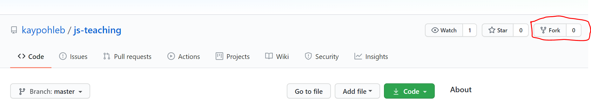</div>

The next step would be to choose the account to which you would like to fork (this step is only applicable if your Github is linked to multiple accounts)

<div style="text-align:center">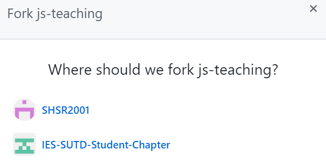</div>

Once you do this you would have now sucessfully forked the given repo into your account.

<div style="text-align:center">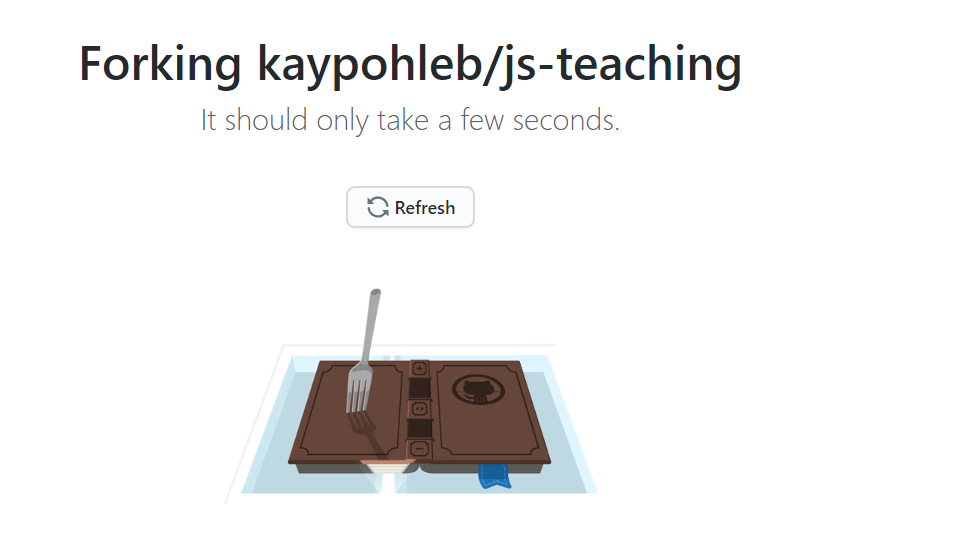</div>

<div style="text-align:center">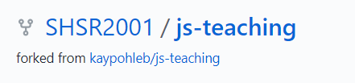</div>

### Creating a new branch on Github

Previously, we have explain how you can create a new branch on your local Git repository. As it turns out, you can also create a new branch directly on Github (e.g. when you want to make your own changes first before integrating/merging them back into the master branch)!

To do so, simply click on the `Branch: master` button and inside the `Find or create a branch...` text box, type in the name of your new branch (in this case, I will call the branch `working`). Then click on the button the appears below to create your new branch!

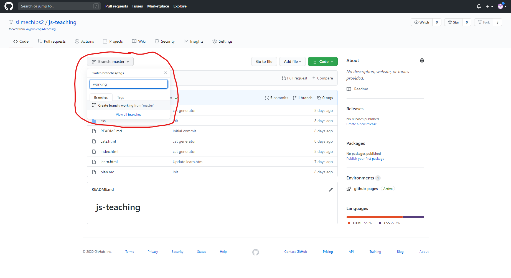

You have now created a new branch! You should now see the `Branch: master` button has changed to `Branch: working` to indicate that you are on the new branch. You can switch to other branches (e.g. back to master) at any time by clicking on the Branch button.

### Cloning the repository

Now that that we have our repository (whether you forked it, or you have edit rights to it), let us **clone** this repository onto our local machine. Start off by copying the clone address.

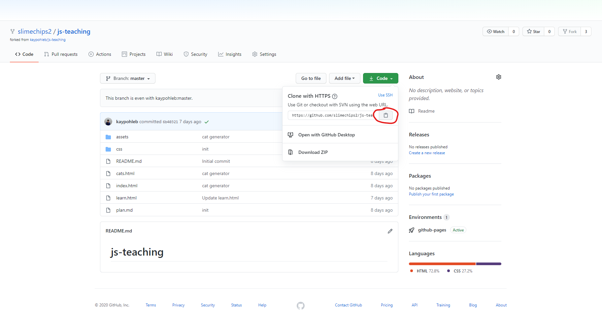

Then, on your local computer, navigate to the parent directory of where you want to store the project files, then open your terminal or Git Bash (Windows Hint: Right click -> `Git Bash Here`), then type in the following command, followed by the url you copied (Windows Hint: Right click to paste)

```bash
git clone <your repository url here>
```

This will clone the git repsitory from Github onto your local machine (Git will create a new folder to store these files). When you clone this repsitory instead of downloading the files as a zip, the repository on your local machine is automatically linked to the one online.

To simulate making changes to the project, let us go and make some changes to the pulled repository! (Hint: remember to use `cd <folder_name>` to bring your git bash into your newly cloned repository. In this case it would be `cd js-teaching`)

### Example: Making changes to the project

*Note: This step is just to simulate making changes to your project.*

For now, let us just change the title of the webpage. Edit `index.html` that is in your repository using your favourite text editor (or just use Notepad), and change the words on line 7 from `<title>Main Page</title>` to `<title>GitHub Rocks!!!</title>`

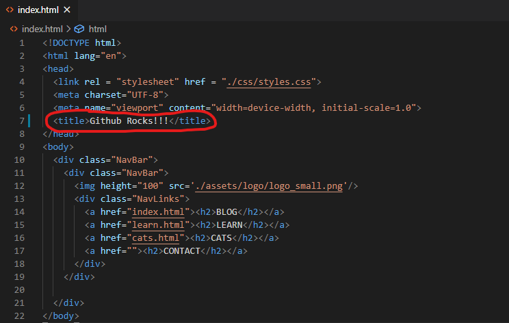

### Commiting your changes and pushing them onto Github

Now that we have made our changes run the following commands in order to add these changes to our staging area (Please read Session 1 notes if you dont understand what is going on!!!), and then commit the changes to the `working` branch of your pulled repo (Note: Ensure that you are on master branch by doing `git branch`, your current branch is highlighted) 

```bash
git add index.html
git commit -m 'Change title of index.html'
```

Now, we want to push our changes on to our online Github repository. Recall that we can simply do this with

```bash
git push
```

Once you do this, you should now click on "New Pull Request" and open a pull request and once you are done writing the title and the comment of the pull request hit "Create a pull request" and you should see something like this appear on your screen!


And once this is done you should be able to see something like this!


## Pull Requests

Now let us turn our attention to pull requests. Assuming that you have now made some changes to the forked repository and you believe would these changes would add great value to the original repository as well then you could "send" whatever changes you have made back to the original repository in the form of a pull request. After you send in the pull request it is entirely up to 3DC to accept or reject that pull request. 

Now that we have discussed the concepts behind forks and pull requests let us now actually implement these concepts and see how it works in action!

## Hosting your Website on Github Pages

Github Pages is an easy way to host static websites containing HTML, CSS, and JavaScript files straight from a repository on GitHub. Yes that means, you can publish the website files from your Github repository directly!

Note that this Github Page website will be published on the following URL as a project website: `http(s)://<user>.github.io/<repository>`

Start by going to your online repository on Github (or you can use the one you forked). The steps are simple. 

1. Go to the repository settings 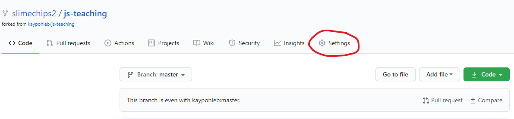
2. Scroll down to the **Github Pages** section
3. From here, select the source branch to the **master** branch. (*Note that you can only select the master branch or none*) 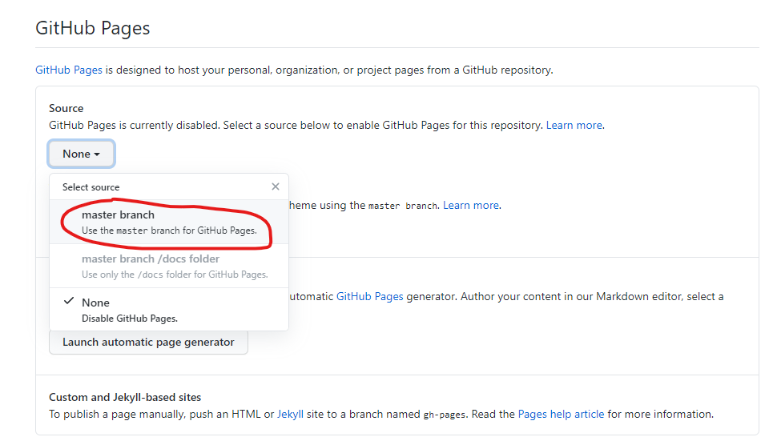
4. After selection, give Github about a minute or so to publish your website (go ahead and make a coffee or something). Refresh the page, scroll back down to the Github Pages section and you should see a message telling you your page has been published! 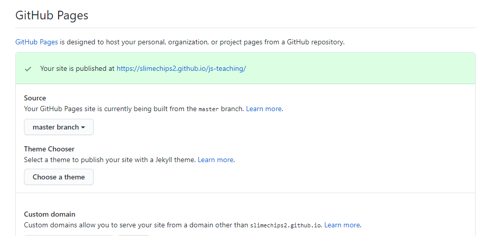
5. Click on the link provided and you should see your static website up and running. Go ahead and click on the link to play around with your new website! 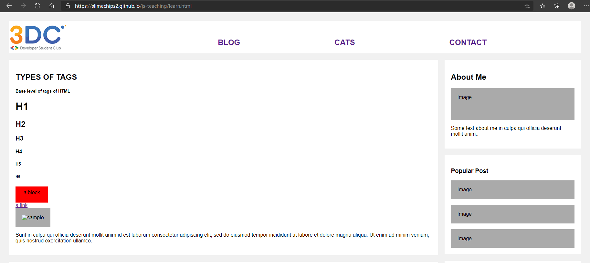