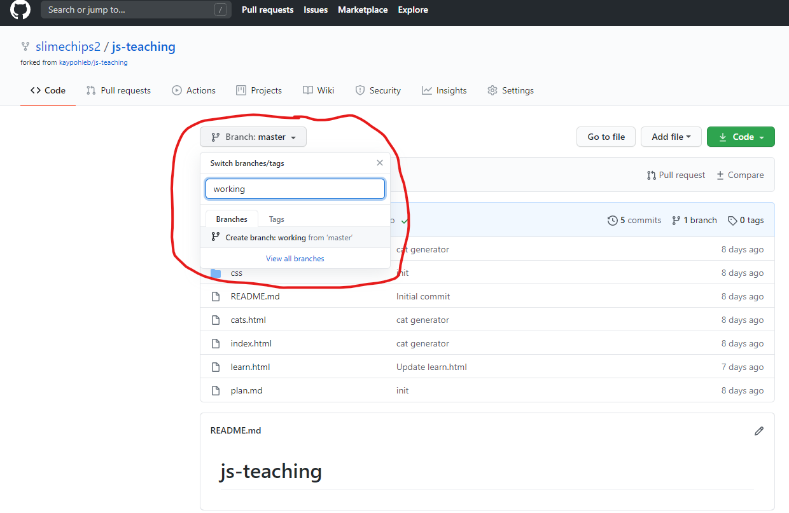
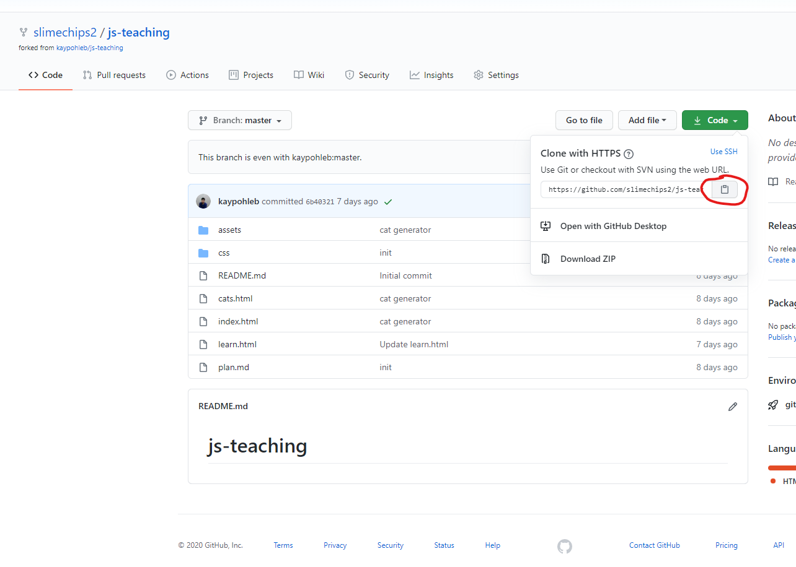

# Git with Github

1. [1. Introduction](#1-introduction)
2. [2. Creating a GitHub account (Skip this if you already have one)](#2-creating-a-github-account-skip-this-if-you-already-have-one)
3. [3. Route A: Uploading an exisiting repository on local machine to Github](#3-route-a-uploading-an-exisiting-repository-on-local-machine-to-github)
   1. [3.1. Creating a Repository on GitHub](#31-creating-a-repository-on-github)
   2. [3.2. Adding Collaborators to your personal repository](#32-adding-collaborators-to-your-personal-repository)
   3. [3.3. Remote Repositories](#33-remote-repositories)
      1. [3.3.1. (```git remote add```) Adding a Remote](#331-git-remote-add-adding-a-remote)
      2. [3.3.2. (`git push`) Upload changes to remote Github repository](#332-git-push-upload-changes-to-remote-github-repository)
4. [4. Route B: Cloning a Github Repository onto your local machine](#4-route-b-cloning-a-github-repository-onto-your-local-machine)
   1. [4.1. Forking a repository](#41-forking-a-repository)
   2. [4.2. Creating a new branch on Github](#42-creating-a-new-branch-on-github)
   3. [4.3. Cloning the repository](#43-cloning-the-repository)
5. [5. Making changes to remote repository directly](#5-making-changes-to-remote-repository-directly)
6. [6. (```git pull``` and ```git fetch```) Receiving changes from the remote repository, on your local repository](#6-git-pull-and-git-fetch-receiving-changes-from-the-remote-repository-on-your-local-repository)
   1. [6.1. (`git pull`) Get your changes and update local repository with changes immediately](#61-git-pull-get-your-changes-and-update-local-repository-with-changes-immediately)
   2. [6.2. (`git fetch`) Get your changes, but don't update local repository with changes immediately](#62-git-fetch-get-your-changes-but-dont-update-local-repository-with-changes-immediately)
7. [7. Example: Making changes to the project locally](#7-example-making-changes-to-the-project-locally)
   1. [7.1. Commiting your changes and pushing them onto Github](#71-commiting-your-changes-and-pushing-them-onto-github)
8. [8. Creating Pull Requests](#8-creating-pull-requests)
9. [9. Hosting your Website on Github Pages](#9-hosting-your-website-on-github-pages)
10. [10. Conclusion](#10-conclusion)

## 1. Introduction

Welcome to using Git with Github! Today, we will see how you can integrate Git with online repository hosting services such as Github, and host a website Github. Let's have a quick recap from the previous session.

**Git** is a **version control tool**. It helps you to manage the project history of modern projects (usually software). It is almost always an essential tool when collaborating with others on software projects.

<div style="text-align:center"></div>

**Github** is a popular **Git repository hosting service**. A Git repository is a virtual Git collection, containing different versions of your project files. You can find many Git repositories on Github's website (www.github.com)

Let us see how we can use Github.

## 2. Creating a GitHub account (Skip this if you already have one)

Step 1: Go to [the Github Signup Page](https://github.com/join) in any web browser

Step 2: Enter all your personal details: your desired username, email Id and Password and hit "Sign up for GitHub"
<div style="text-align:center"></div>

Step 3: Click the Complete any CAPTCHA puzzle you are asked to complete and hit "Join a Free Plan"
<div style="text-align:center"></div>


Step 4: Select all your preferences 

Step 5: Verify your email address 

Step 6: Skip any other step for now

## 3. Route A: Uploading an exisiting repository on local machine to Github

This route is applicable when you have created a **local Git repository on your machine**, and want to **upload it online onto Github**, perhaps to collaborate with your teammates.

Please refer to to [The Day 0 Notes](0_Install_Git.md) to install Git. (if not already done)

Then follow the steps below to create a Git respoitory on your local computer containing these files.

1. **Create** a git repository inside an empty folder with `git init`
2. **Download sample project files** for a website from here: https://github.com/kaypohleb/js-teaching
3. **Unzip** the files into the empty folder with the git repository (Note: Step 2 and 3 are just simulating that you have done some work for a project on your local machine that has yet to be linked to GitHub)
4. `git add --all` to add all new files to the **staging area**
5. `git commit -m 'Initial Commit'` to **commit** the new files into the git repository.


### 3.1. Creating a Repository on GitHub

Step 1: On the upper right corner of any page on the GitHub website, click the "+" icon and then click the option that says "New Repository

<div style="text-align:center"></div>

Step 2: Type in the name and the optional description for the new repository 

Step 3: Choose whether you would like to make this repository a public or a private one. Let us choose the private option for now

Step 4: You can choose to initialise your repository with a README file, which is essentially a document that describes your project. However, we are going to just upload an existing project, so uncheck the ***Initialise this repository with a README*** box.

<div style="text-align:center"></div>

### 3.2. Adding Collaborators to your personal repository

You can add your friends/project-mates as your collaborators on GitHub just by knowing their username, full-name or email ID

Step 1: In your repository's main page, click on the settings page

<div style="text-align:center"></div>


Step 3: On the panel to your left, click on the "Manage Access" option 

<div style="text-align:center"></div>


Step 4: In this page, scroll to the bottom and click on the "Invite a Collaborator" option. You are now prompted to enter either the username, email ID or the full-name of your soon to be project collaborator. 

You can either add your friends (as long as they have a Github Account) as collaborators or a throwaway account (`3DCWorkshopThrowaway`). The user will receive an email to collaborate (they will have to accept it to collaborate). 

Once you are done finding that person click on "Select a collaborator above"

<div style="text-align:center"></div>

Right now, our repository on Github has been set up, but it is empty. Let us see how we can add an existing project from our computer into it.

### 3.3. Remote Repositories 

Remote repositories are useful when you need to **share your local project** with your teammates. Usually, you make your modifications and commits locally as you have seen before! Whenever you want to share your changes with your teammates you can choose to upload these changes to a remote repository. They act as a means for sharing and exchanging code between developers. The Github repository we just created is a remote repository (but empty for now).

Given below is a pictorial representation of the local-remote workflow

<div style="text-align:center"></div>

We will now see how you can link the remote Github repository with your local Git repository(containing the website).

#### 3.3.1. (```git remote add```) Adding a Remote

To add a new remote, we make use of the ```git remote add``` command on the terminal, in the directory where your repository is stored. The command takes in two arguments:
  1) A unique remote name (usually by default we call it `origin`)
  2) A remote URL, which is found in the "Source" sub-tab of your GitHub repo (On the GitHub website). If you do not know where this is refer to the screenshot below 
  
  <div style="text-align:center"></div>
  
it should be executed in the following format:
  
```bash
git remote add <remote name> <remote URL>

### Example
git remote add origin https://github.com/3DCdsc/Intro_to_Git
```
  
Once this is done you could use the ``` git remote -v``` command to verify your remote
  
#### 3.3.2. (`git push`) Upload changes to remote Github repository

Previously, what we learnt with ```git add``` and ```git commit``` only affects the local repository. To push your changes from the local repository to the remote Github repository, a third ```git push``` command is necessary, so let's do it! This is used to send all committed changes to remote repositories for collaboration. Team members will be able to access the new changes you have made.

```bash
git push
```

This is the most basic command to push your changes from your current branch onto corresponding branch on the remote repository.

``` bash
git push <remote> <branch>
```
This command allows you to push the specified branch into the specified remote, even when you are not on the specified branch.

```bash
git push <remote> --force
```
This command allows you to force a push when you need to replace the remote history with your local history. Force pushing is not considered to be a good practice and thus we advise you against using this command unless you are **absolutely** sure of what you are doing (For example, if you initialised the online Github Repository with a README and want to get rid of it).

```bash
git push <remote> --all
```
This command allows you to push all your local branches into the specified remote.


## 4. Route B: Cloning a Github Repository onto your local machine

Imagine your friend, or someone else has created an online repository on Github, with some prexisting files in it already. This route will explain how you might collaborate with your friend to work the existing repository, **OR** create your own copy of the repository and work on it yourself.

### 4.1. Forking a repository

This step is applicable if you want to create your own copy of the repository, without affecting the original repository. Note that if you already have edit rights to the repository and want to edit it directly, you do not need to do this step. Let us first begin by understanding what forking is.

<div style="text-align:center"></div>

Assume that the above diagram represents a repository. Now let us say that this repository is sitting on GitHub in 3DC's account. Suppose you want to have a copy of this repository as it is on your account as well so that you can access everything that is inside this repository and make changes to the stuff that is in there without affecting what is currently sitting on 3DC's account. To do this you will need to "Fork" the repository. What this does is that it takes an entirely different instance of the repository and adds it to your account. 

To fork a repository you can simply go to the repository's page and hit the fork button on the top right corner. Let's go ahead and fork the same repository we downloaded just now (https://github.com/kaypohleb/js-teaching)

<div style="text-align:center"></div>

The next step would be to choose the account to which you would like to fork (this step is only applicable if your Github is linked to multiple accounts)

<div style="text-align:center"></div>

Once you do this you would have now sucessfully forked the given repo into your account.

<div style="text-align:center"></div>

<div style="text-align:center"></div>

### 4.2. Creating a new branch on Github

Previously, we have explained how you can create a new branch on your local Git repository (A branch is a pointer to a snapshot to a different version version of your project, usually this snapshot contains features that are not yet fully developed/integrated). Recall all you had to do was (no need to do this now):

```bash
git branch <branch_name>
``` 

As it turns out, you can also create a new branch directly on Github (e.g. when you want to make your own changes first before integrating/merging them back into the master branch)!

To do so, simply click on the `Branch: master` button and inside the `Find or create a branch...` text box, type in the name of your new branch (in this case, I will call the branch `working`). Then click on the button the appears below to create your new branch!



You have now created a new branch! You should now see the `Branch: master` button has changed to `Branch: working` to indicate that you are on the new branch. You can switch to other branches (e.g. back to master) at any time by clicking on the Branch button.

### 4.3. Cloning the repository

Now that that we have our repository (whether you forked it, or you have edit rights to it), let us **clone** this repository onto our local machine. Start off by copying the clone address.



Then, on your local computer, navigate to the parent directory of where you want to store the project files, then open your terminal or Git Bash (Windows Hint: Right click -> `Git Bash Here`), then type in the following command, followed by the url you copied (Windows Hint: Right click to paste)

```bash
git clone <your repository url here>
```

This will clone the git repsitory from Github onto your local machine (Git will create a new folder to store these files). When you clone this repsitory instead of downloading the files as a zip, the repository on your local machine is automatically linked to the one online.

## 5. Making changes to remote repository directly

Let us make some changes in the remote repository. In Github, you can make changes to files directly, by clicking on the edit button.


Let us add some more content to the readme by adding some text.


Once you are done, you can commit your changes directly on the remote Github repository by clicking on the ***Commit Changes*** button.

## 6. (```git pull``` and ```git fetch```) Receiving changes from the remote repository, on your local repository

We have made some changes on the remote GitHub repository, now it is time to synchronise these changes onto our local Git repository!

### 6.1. (`git pull`) Get your changes and update local repository with changes immediately

If you want to get your changes and update your local Git repository immediately, you can use (Make sure there are no conflicting changes in your local Git repository):

```bash
### This is usually what you need, go ahead and execute this command
git pull
```

Any new branches on the remote repository would also be automatically pulled into your local repository (but to see those branches you will need to use `git checkout`).

If you want to pull in changes from a **specific** branch into your **current** branch (this will cause a `git merge`), you can use

```bash
git pull <remote_name> <branch_name>

### Example
git pull origin some_branch_name

### By default, *git pull* without any arguments will invoke something like
git pull origin <current_branch_you_are_on>

### You can pull and update for all branches with
git pull --all
```

### 6.2. (`git fetch`) Get your changes, but don't update local repository with changes immediately

If you however, only want to get the changes from the remote git repository, but do not want the remote changes to be applied yet (e.g. when you are still working on some changes locally), you can use

```bash
git fetch
```

Note that the options for git fetch are very similar.

```bash
git fetch <remote_name> <branch_name>

### Example
git fetch origin some_branch_name

### By default, *git pull* without any arguments will invoke something like
git fetch origin <current_branch_you_are_on>

### You can pull and update for all branches with
git fetch --all
```

When you are ready to merge/integrate the changes that you have fetched into the local repository, you can use `git merge`.

## 7. Example: Making changes to the project locally

*Note: This step is just to simulate making changes to your project.*

To simulate making changes to the project locally, let us go and make some changes to any of your local repositories! (Hint: remember to use `cd <folder_name>` to bring your git bash into your newly cloned repository. In this case it would be `cd js-teaching`)

Before making changes, let us switch to the `working` branch, so that we are making the changes on that branch, instead of the master branch.

```bash
git checkout <branch_name>
```

We will merge the changes back into master when we are happy with the changes. 

For now, let us just change the title of the webpage. Edit `index.html` that is in your repository using your favourite text editor (or just use Notepad), and change the words on line 7 from `<title>Main Page</title>` to `<title>GitHub Rocks!!!</title>`


### 7.1. Commiting your changes and pushing them onto Github

Now that we have made our changes run the following commands in order to add these changes to our staging area to be committed, and then commit the changes to the `working` branch of your pulled repo (Note: Ensure that you are on `working` branch by doing `git branch`, your current branch is highlighted. If you are not on working branch please use `git checkout working`) 

```bash
git add index.html
git commit -m 'Change title of index.html'
```

Now, we want to push our changes on to our online Github repository. Recall that we can simply do this with

```bash
git push

### IMPORTANT NOTE: If you created a new branch on your local repository that does not yet exist on your remote repository, you will need to set a new branch upstream to your remote repository, before you can push it
git push --set-upstream origin <new_local_branch_name>

```

Check the repository online to verify the commit has been added. (Go to the working branch on Github)


Click on the file to verify your changes.


## 8. Creating Pull Requests

Now, let us assume that you want to get approval from your friend regarding your changes. So basically, you want approval to merge your requests from the `working` branch into the `master` branch. You can open a **pull request**. A **pull request** allows your friend, or anyone with access rights to the repository to review the request and compare changes side by side on Github.

Let's try out by creating a pull request.

Click on the Pull Requests tab near the top of the window. Then click on "Create New Pull Request".


In the pull request screen, you will see changes being compared. The two dropdown boxes on the left show the branch that is being merged into, and the two dropdown boxes on the right show the branch that is being merged into. Note that you have the ability to choose to merge into a branch of a repository you have forked from (or other forks of that repository). This is great for recommending changes to open source projects that you have forked from. 


For now, we are just going to try to merge back into the master branch of our own repository. Select your own repository as the base repository, then select the branch you want to merge from (i.e. `working` branch).


You are able to see the changes between the two branches. Also note that near the top, Github tells you that the two branches can be merged (i.e. there are no conflicts between the branches, recall "fast-forward merge" from day 1). Go ahead and click on the "Create pull request" button to add more details to your pull request ,such as adding reviewers (ideally this would be your friend or the owner of the repository) and comments, and click the button one more time to finally create the pull request!


And once this is done you should be able to see something like this!


# More about Pull Requests

Assuming that you have now made some changes to the forked repository and you believe would these changes would add great value to the original repository as well then you could "send" whatever changes you have made back to the original repository in the form of a pull request. After you send in the pull request it is entirely up to 3DC to accept or reject that pull request. 

Now that we have discussed the concepts behind forks and pull requests let us now actually implement these concepts and see how it works in action!

## 9. Hosting your Website on Github Pages

Github Pages is an easy way to host static websites containing HTML, CSS, and JavaScript files straight from a repository on GitHub. Yes that means, you can publish the website files from your Github repository directly!

Note that this Github Page website will be published on the following URL as a project website: `http(s)://<user>.github.io/<repository>`

As it turns out, the project you cloned/forked from 3DC contains file for the website! Start by going to your online repository on Github (or you can use the one you forked). The steps are simple. 

1. Go to the repository settings 
2. Scroll down to the **Github Pages** section
3. From here, select the source branch to the **master** branch. (*Note that you can only select the master branch or none*) 
4. After selection, give Github about a minute or so to publish your website (go ahead and make a coffee or something). Refresh the page, scroll back down to the Github Pages section and you should see a message telling you your page has been published! 
5. Click on the link provided and you should see your static website up and running. Go ahead and click on the link to play around with your new website! 
6. You will note that the title of the main page is also whatever you have changed it to, from previously.

## 10. Conclusion

Git is a tool that can be used with just very basic commands, but if you would like to do something complicated, such as choosing certain commits to be reverted, or erasing commit history, you will need to use more advanced commands. When in doubt, just search online for answers, chances are someone on sites like Stack Overflow may have asked the same question.

If there is a so-called minimum list of commands that I would say everyone should know, they are

```bash
git init # Initialise a git repository within the current folder
git status # Displays information such as files in the staging area, changes not yet int the staging area, current branch
git log --oneline # Displays the recent commit history in a succint format. Use --all as well to show all history, --graph to show branch history as well
git clone <url_of_repository> # Obtain a copy of a remote repository onto your computer
git remote add origin <url_of_repository> # Set the remote repository of a local repository
git add <file> # Add a file/folder to the staging area, to be committed. Omit the <file> and use --all if you just want to add all your changes
git reset -- HEAD <file_name> # Remove a file/folder from the staging area, so it would not be commited
git commit -m "Some commit message" # Commit the files in the staging area, with a commit message
git push # Push commits from your local repository to a remote repository
git pull # Get commits from remote repository and immediately update your local repository with the changes

#------ More advanced stuff below related to branching-------#

git branch # Check the branches that you have, and which one you are currently on
git branch <branch_name> # Create a new branch with the given name
git checkout <branch_name_or_commit_hash> # Move where your currently are (HEAD) to an existing branch
git checkout -b <new_branch_name> # A quick way to create a new branch and checkout to it immediately
```

Of course, some Git GUI tools allow you to bypass memorising these commands, but I think it is still important to know what exactly your Git GUI tools are actually doing in the background.
