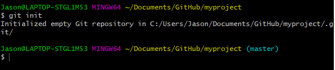

# Intro_to_Git_Workshop

This is an introductory workshop to Git, created by 3DC. This Readme contains the lesson content for this workshop, including sample snippets.

1. [What is Git and why should I learn Git?](#what-is-git-and-why-should-i-learn-git)
2. [What is GitHub and how is it different from Git?](#what-is-github-and-how-is-it-different-from-git)
3. [Installation (Git)](#installation-git)
   1. [Windows](#windows)
   2. [Mac OS X](#mac-os-x)
   3. [Linux (Ubuntu/Debian)](#linux-ubuntudebian)
   4. [Linux (Fedora)](#linux-fedora)
4. [Environment Setup](#environment-setup)
   1. [Credentials](#credentials)
5. [Creating your first Git Repository](#creating-your-first-git-repository)
6. [Checking the status of your Git Repository](#checking-the-status-of-your-git-repository)
7. [Adding files to your Git Repository](#adding-files-to-your-git-repository)
   1. [The Staging Area](#the-staging-area)
  

## What is Git and why should I learn Git?  

<div style="text-align:center"></div>

Git is a version control tool. It helps you to manage the project history of modern projects (usually software). It is almost always an essential tool when collaborating with others on software projects.

Modern projects are usually iteratively improved, and Git helps us to manage these small iterations efficiently and cleanly.

## What is GitHub and how is it different from Git?

<div style="text-align:center"></div>

Github is a popular Git repository hosting service. A Git repository is a virtual Git collection, containing different versions of your project files. You can find many Git repositories on Github's website (www.github.com)

We will first start with the fundamentals of Git.

## Installation (Git)

### Windows

You will need to install [Git Bash for Windows](https://git-scm.com/download/win). Just follow the installation instructions and choose the default settings for now.

### Mac OS X

If it is not already installed, use the following command in Terminal

```terminal
brew install git
```

### Linux (Ubuntu/Debian)

If it is not already installed, use the following command in bash

```bash
sudo apt-get install git
```

### Linux (Fedora)

If it is not already installed, use the following command in bash

```bash
sudo yum install git
```

## Environment Setup

From now onwards, the commands used in this tutorial will be done in a terminal window (Windows: Git Bash, Mac OS X: Terminal, Linux: Bash)

### Credentials

Let's set up your name and email address. This information is used to identify you whilst you are making changes to your project.

```bash
git config --global user.name "Your name here"
git config --global user.email youremail@email.com
```

## Creating your first Git Repository

Recall a Git repository is a virtual Git collection, containing different versions of your project files. This git repository can reside inside a local folder inside your computer, and it can also be linked to a remote repository on somewhere like Github. (This concept is somewhat similar to a file-hosting website like Dropbox)

For now, we shall start by creating a local Git repository.
1. Navigate to a local location in your computer
2. Create an empty folder for your repository.
3. Open the folder in your Git Bash/Terminal (Hint: Right Click inside your empty folder, select `Open in Git Bash` or `Open in Terminal`)
4. Use the following command to initalise a git repository inside this folder

```bash
git init
```

You should see a message acknowledging the creation of the git repository.


## Checking the status of your Git Repository

To check the status of your Git repository (as a sanity check or whatever), you can use the following command. This command also checks that the git repository has been initialised.

```bash
git status
```

You should see something like this: 


You will understand meaning of the messages later.

## Adding files to your Git Repository

[Download]() the following files, which contains a template for a personal website, and place them inside your folder with the git repository.

While the files are already in the folder (**working directory**), they have not yet been "added" to the **repository** per say, you need to **manually add** these files into the repository using git commands.

You can confirm this by using `git status` to check. You will see something like this:


You will find the files listed under **untracked files**.

### The Staging Area


The **staging area** can be thought of as the intermediary between your folder (working directory) and the git repository