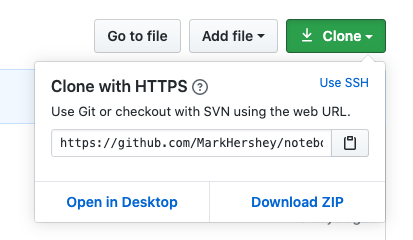
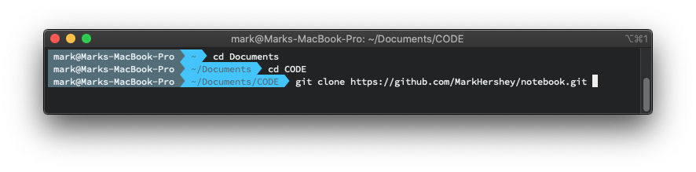

# Get Started with Git & GitHub

## What is the difference between Git and GitHub?

#### TLDR:
- **`Git`** is a version control software that manages your local git repositories.

- **`GitHub`** is an online hosting service for your git repositories.

#### Long version:
- **`Git`** is open-source software that helps you manage code versions, keep track of file changes. You can interact with `git` using CLI (Command Line Interface), meaning you type in git commands in your shell/ terminals. Alternatively, you can choose to use a third-party GUI (Graphical User Interface) from [here](https://git-scm.com/downloads/guis/).

- **`GitHub`** is an online platform developed by a company and then acquired by Microsoft in 2018. GitHub, the platform, provides free hosting service for git repositories, which usually contains code or text files. It also enables collaboration on projects, since the repository is hosted on the cloud, teams can collaborate on the project repository from different locations. GitHub is an online service that is built around git, making git more convenient and powerful for programmers especially teams.


## Install Git

#### For macOS:

Just run the following command in your terminal to check your git version, it will prompt you to install Git if you don't have it.

```
git --version
```

#### For Other Operating Systems:

Refer to: [Getting Started Installing Git](https://git-scm.com/book/en/v2/Getting-Started-Installing-Git)

## Configure Git

#### Setting up Git username and email address
Just letting `Git` know who you are. If you already have a `GitHub` account, keep the email address for your `Git` at local same as your `GitHub` email address.

- To check current username and email address for Git.
- It returns nothing if no name/email has been set.

```
git config --global user.name
git config --global user.email

```

- To set username and email address for Git.
- `--global` means to set for all the repositories on your machine.
- If you only want to set for a single repository, do it without the `--global` flag.

```
git config --global user.name "Tom Cruise"
git config --global user.email "tom@example.com"

```


## Work with local Git repositories

#### `git init`

- initiate a git repository at current working directory
- a hidden folder `.git/` will be created, thats where all git-related stuff will be stored.

#### `git add`

- Any changes you made inside a `git` repository have to be **staged** first before **committing**.
- It is a way to let `git` know what are the files/changes you want `git` to keep track of.
- `git add <filename>` stages your changes on `<filename>`.
- `git add -all` stages all your untracked changes within the repository.


#### `git commit`

- `git commit -m "YOUR COMMIT MSG"` commits (saves) your staged changes with a short commit message.

#### `git commit -a`

- `git commit -a` is a combination of `git add --all` and `git commit`.
- This command automatically stages and commits files that have been modified and deleted, but not new files you have just created.

#### `git branch`

- `git branch` shows what branches you have.
- `git branch -vv` shows your branches with more details.
- `git branch <NEW BRANCH NAME>` creates a new branch from current head.

#### `git checkout`

- `git checkout` operates upon three distinct entities: `files`, `commits`, and `branches`.
- `git checkout <BRANCH NAME>` switches to another existing branch.
- `git checkout -b <NEW BRANCH NAME>` creates a new branch and switches to it simultaneously.
- `git checkout <COMMIT HASH STRING>`


#### `git log`

- `git log` shows your commit history.
- `git log --oneline` shows your commit history, one commit per line.
- `git log --graph` shows your commit history with a simple graph illustration.


#### `git status`

- `git status` allows your to check:
    - which branch are you in?
    - Is this branch up to date with master branch?
    - what are the staged files that are not yet committed?
    - what are the not yet staged files?


#### `git help <git command>`

- get help on a particular git command.
- for example, you can do `git help branch`


---

## Work with remote Git repositories


### Get started with GitHub

1. Create a GitHub account
2. Create a repo on GitHub
3. Initiate your repo with a `README.md` file
4. Clone your own repo to local
5. Create a new file / make changes to your files
6. Stage your changes
7. Commit Changes
8. Push commits to GitHub

#### `git clone`
"Clone" means to copy or download a remote repository to your local machine.

- Clone a repository does not affect the original repository in any way, since you just make a copy only.
- You can clone your own repository and others' repository, basically any public repository.
- If you are cloning your own private repository, you will be required to log into your GitHub account after you key in the clone command.  
- When you clone a repository with `git clone`, it automatically creates a `remote` connection called `origin` pointing back to the cloned repository. This is useful for developers creating a local copy of a central repository, since it provides an easy way to pull upstream changes or publish local commits. This behaviour is also why most Git-based projects call their central repository origin.

*Example:*

1. Go to your interested GitHub repository page, copy the `clone` URL

    


2. Use terminal and navigate to the root directory you wish to clone the repo into.

3. Example: `git clone https://GitHub.com/MarkHershey/notebook.git`



#### `git push`

- `git push <REMOTE NAME> <BRANCH NAME>` pushes commits to specified remote branch.

#### `git remote`

- `git remote -v` checks any remote links to current repository。
- `git remote add <NAME> <URL>` add remote connection.
- `git remote rm <NAME>` removes a remote connection.
- `git remote rename <OLD NAME> <NEW NAME>` renames a remote connection.

#### `git fetch`

- `git fetch` downloads any updates from remote。
- `git fetch <remote>`
- `git fetch --all`

#### `git pull`

#### `git merge`

#### `git blame`

- `git blame <filename>` allows you to check who contributed which line inside a file.
- `git blame -L 1,5 <filename>` for showing line 1 to 5 only.
- `git blame -L 1,+5 <filename>` for showing 5 lines only starting from line 1.
- `git blame -e <filename>` for showing user.email instead of user.name


## Contribute to Someone's Repository

#### Contribute to a project where you have collaborator access

1. Create a new `branch`.
2. Make changes on your `branch`.
3. Open a Pull Request to merge your `branch` to `master` `branch`.

#### Contribute to a project where you don't have write access

1. `Fork` the original repository on GitHub.
2. Make changes on your forked repository.
3. Open a `Pull Request` to merge your repo into the original repo.


## Undoing Commits & Changes

[Reference](https://www.atlassian.com/git/tutorials/undoing-changes)

#### `git checkout`

1. Use `git checkout <COMMIT HASH>` to view the commit you want to revert back to. Now, you have entered a `detached HEAD` state.
2. Create a new branch from here by using `checkout -b <NEW BRANCH NAME>`

#### `git clean`

#### `git revert`

- `git revert <COMMIT HASH>` creates a new commit at `HEAD` that revert the changes made in the commit specified only. It does not change history, it does not revert commit in between current `HEAD` and the commit specified.


#### `git reset`

#### `git rm`

---


#### How to un-stage a file?

#### How to change a commit message?

#### How to roll back to a particular commit?

#### How to delete a branch?

#### How to make Git stop tracking a file

#### How to let git ignore certain files


---

## Further Readings

- Great `Git` tutorials by [Atlassian Bitbucket](https://www.atlassian.com/git/tutorials/syncing)
- If you want to learn `Git` more systematically, [Pro Git](https://git-scm.com/book/en/v2) is a great book.
