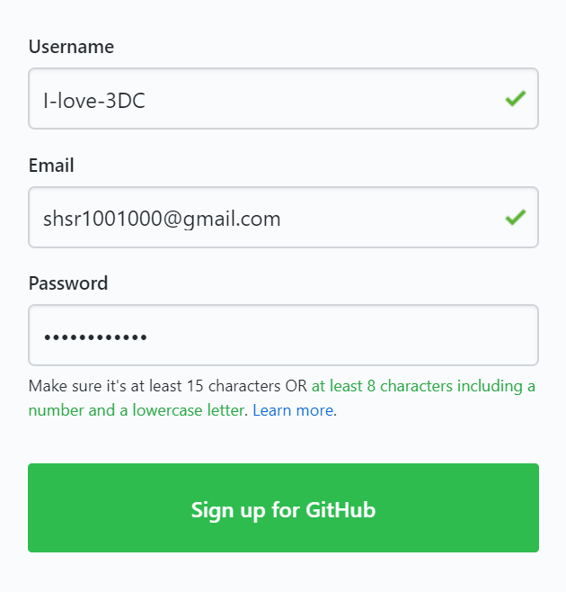
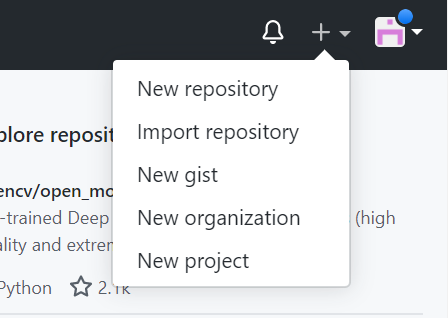
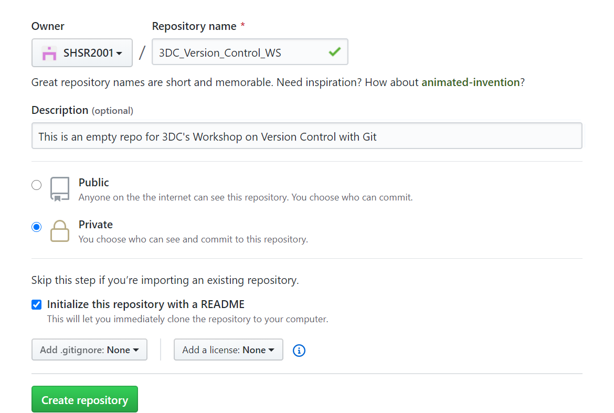
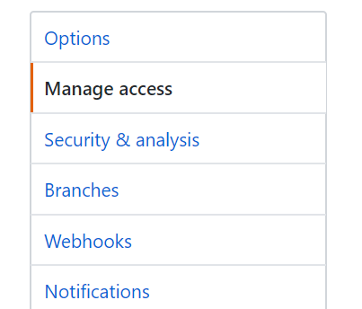
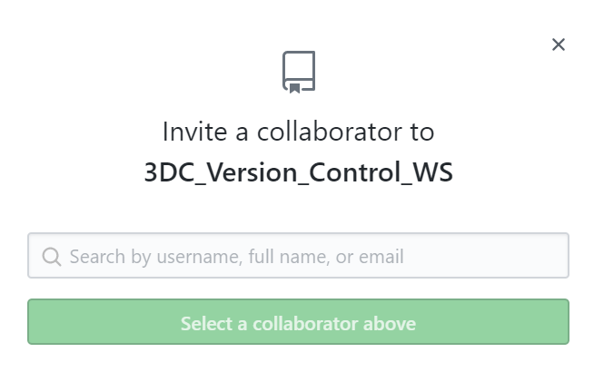
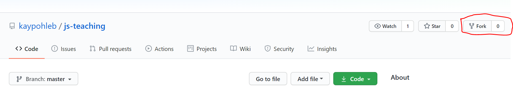

# Intro_to_Git_Workshop

This is an introductory workshop to Git, created by 3DC. This Readme contains the lesson content for this workshop, including sample snippets.

1. [What is Git and why should I learn Git?](#what-is-git-and-why-should-i-learn-git)
2. [What is GitHub and how is it different from Git?](#what-is-github-and-how-is-it-different-from-git)
3. [Installation (Git)](#installation-git)
   1. [Windows](#windows)
   2. [Mac OS X](#mac-os-x)
   3. [Linux (Ubuntu/Debian)](#linux-ubuntudebian)
   4. [Linux (Fedora)](#linux-fedora)
4. [Environment Setup](#environment-setup)
   1. [Credentials](#credentials)
5. [Creating your first Git Repository](#creating-your-first-git-repository)
6. [Checking the status of your Git Repository](#checking-the-status-of-your-git-repository)
7. [Adding files to your Git Repository](#adding-files-to-your-git-repository)
8. [Staging, Committing and pushing Changes](#staging-committing-and-pushing-changes)
9. [Viewing the committed History](#viewing-the-committed-history)
10. [Removing a File](#removing-a-file)
11. [Creating a GitHub account](#creating-a-github-account)
12. [Creating a Repository on GitHub](#creating-a-repository-on-github)
13. [Adding Collaborators to your personal repository](#adding-collaborators-to-your-personal-repository)
14. [Remote Repositories](#remote-repositories)
   1. [Adding a Remote](#adding-a-remote)
   2. [Pushing to GitHub Remote](#pushing-to-github-remote)
15. [Branching](#branching)
16. [Merges](#merges)
   1. [Preparing to Merge](#preparing-to-merge)
   2. [Merging](#merging)
17. [Fast Forward Merge](#fast-forward-merge)
   1. [3-Way Merge](#3-way-merge)
   2. [Resolving Merge Conflicts](#resolving-merge-conflicts)
18. [Forking and Pull Requests](#forking-and-pull-requests)
19. [Hosting your Website on Github Pages](#hosting-your-website-on-github-pages)
  

## What is Git and why should I learn Git?  

<div style="text-align:center"></div>

Git is a version control tool. It helps you to manage the project history of modern projects (usually software). It is almost always an essential tool when collaborating with others on software projects.

Modern projects are usually iteratively improved, and Git helps us to manage these small iterations efficiently and cleanly.

## What is GitHub and how is it different from Git?

<div style="text-align:center"></div>

Github is a popular Git repository hosting service. A Git repository is a virtual Git collection, containing different versions of your project files. You can find many Git repositories on Github's website (www.github.com)

We will first start with the fundamentals of Git.

## Installation (Git)

### Windows

You will need to install [Git Bash for Windows](https://git-scm.com/download/win). Just follow the installation instructions and choose the default settings for now.

### Mac OS X

If it is not already installed, use the following command in Terminal

```terminal
brew install git
```

### Linux (Ubuntu/Debian)

If it is not already installed, use the following command in bash

```bash
sudo apt-get install git
```

### Linux (Fedora)

If it is not already installed, use the following command in bash

```bash
sudo yum install git
```

## Environment Setup

From now onwards, the commands used in this tutorial will be done in a terminal window (Windows: Git Bash, Mac OS X: Terminal, Linux: Bash)

### Credentials

Let's set up your name and email address. This information is used to identify you whilst you are making changes to your project.

```bash
git config --global user.name "Your name here"
git config --global user.email youremail@email.com
```

## Creating your first Git Repository

Recall a Git repository is a virtual Git collection, containing different versions of your project files. This git repository can reside inside a local folder inside your computer, and it can also be linked to a remote repository on somewhere like Github. (This concept is somewhat similar to a file-hosting website like Dropbox)

For now, we shall start by creating a local Git repository.
1. Navigate to a local location in your computer
2. Create an empty folder for your repository.
3. Open the folder in your Git Bash/Terminal (Hint: Right Click inside your empty folder, select `Open in Git Bash` or `Open in Terminal`)
4. Use the following command to initalise a git repository inside this folder

```bash
git init
```

You should see a message acknowledging the creation of the git repository.


## Checking the status of your Git Repository

To check the status of your Git repository (as a sanity check or whatever), you can use the following command. This command also checks that the git repository has been initialised.

```bash
git status
```

You should see something like this: 


You will understand meaning of the messages later.

## Adding files to your Git Repository

[Download](https://github.com/kaypohleb/js-teaching) the following files, which contains a template for a personal website, and place them inside your folder with the git repository.

While the files are already in the folder (**working directory**), they have not yet been "added" to the **repository** per say, you need to **manually add** these files into the repository using git commands.

You can confirm this by using `git status` to check. You will see something like this:


You will find the files listed under **untracked files**.

## Staging, Committing and pushing Changes


- The **staging area** can be thought of as the intermediary between your folder (working directory) and the git repository. In the staging area, you decide and **mark** which files that you have added/modified/removed should be updated into the git repository.

The ```git add``` command is used to add changes in the working directory to the staging area. It is used to tell Git that you would like to include updates to a particular file in the next commit. However, ```git add``` does not actually record any change until you run the ```git commit```command

Let us take a closer look on how these commands actually work!

First, you need to edit your files in your working directory. Once you have done that and you are ready to save a copy of your project, you stage the changes using the ```git add``` command. Once you are happy with this staged snapshot, you can commit it to the project history using ```git commit```. The ```git reset``` command can be used to undo a commit or a staged snapshot.

In a Git project timeline, commits are like the core building blocks! They can be thought of as milestones along the timeline of a Git project. Git snapshots are always committed to the local repository. Each developer's local repository acts as the buffer between their contributions and the central repository. 

<div style="text-align:center"></div>

Here are some common options:

```bash
git add <file>
```
this allows you to stage all changes in your file for the next commit 
  
```bash
git add <directory>
```
this allows you to stage all changes in your directory for the next commit 

```bash
git commit 
```
this allows you to commit the staged snapshot. Once this command is run you will be prompted to type in the description of the commit using a text editor

```bash
git commit -a
```
this allows you to commit a snapshot of the changes done in the whole working directory

```bash
git commit -m "<message>"
```
this allows you set the description along with the commit function 

```bash
git commit -am "<message>"
```
this command allows you to combine the -a and the -m options 

we will now see how you can use these commands to commit the changes you made to your personal blog!
  

## Viewing the committed History

The ```git log``` command shows you all the committed snapshots. It is used to list and filter the project history and to search for any particular changes

The log output can be personalized differently by allowing you to filter commits and to display them in an entirely user-defined format

<div style="text-align:center"></div>

```bash 
git log
```
this command allows you to view the entire commit history. It uses space for scrolling and q for exiting if the log output takes up multiple screens

```bash
git log --oneline
```
this command allows you to fit each commit into a single line, which comes in handy when you would like to get an overview of the project history

these are just some of the most commonly used commands, to see the full list of available formatting options use the ```git help log``` command to see the man page for the Git Log tool. Alternatively you could view the [online documentation](https://git-scm.com/book/en/v2/Git-Basics-Viewing-the-Commit-History) here!

## Removing a File

As your project changes over time, there will be times when you would have to remove a file or an entire directory from a repository. Git has a special command to remove files, which also takes some important flags depending on your use-case!

Let us now take a look at the ```git rm``` command and how it can be used to remove files and directories from your repository!

```bash
git rm <filename>
```
this command can be used to remove a single file from the repository

```bash
git rm <filename1> <filename2>
```
this command can be used to remove multiple files

```bash
git rm -r <directory>
```
this command can be used to remove an entire directory from the repository 

However we are not quite done yet! If you run the ```status``` command you will notice that the removal of the file is still in staging and needs to be committed to the repository. 

## Creating a GitHub account

Step 1: Go to [this page](https://github.com/join) in any web browser

Step 2: Enter all your personal details: your desired username, email Id and Password and hit "Sign up for GitHub"
<div style="text-align:center"></div>

Step 3: Click the Complete any CAPTCHA puzzle you are asked to complete and hit "Join a Free Plan"
<div style="text-align:center"></div>


Step 4: Select all your preferences 

Step 5: Verify your email address 

Step 6: Skip any other step for now

## Creating a Repository on GitHub

Step 1: On the upper right corner of any page on the GitHub website, click the "+" icon and then click the option that says "New Repository

<div style="text-align:center"></div>

Step 2: Type in the name and the optional description for the new repository 

Step 3: Choose whether you would like to make this repository a public or a private one. Let us choose the private option for now

Step 4: You can choose to initialise your repository with a README file, which is essentially a document that describes your project. Let us go ahead and do this for now!

<div style="text-align:center"></div>

## Adding Collaborators to your personal repository

You can add your friends/project-mates as your collaborators on GitHub just by knowing their username, full-name or email ID

Step 1: In your repository's main page, click on the settings page

<div style="text-align:center"></div>


Step 3: On the panel to your left, click on the "Manage Access" option 

<div style="text-align:center"></div>


Step 4: In this page, scroll to the bottom and click on the "Invite a Collaborator" option. You are now prompted to enter either the username, email ID or the full-name of your soon to be project collaborator. 

You can either add your friends as collaborators or any of us. Our usernames are: slimechips, MarkHershey, SHSR2001. 

Once you are done finding that person click on "Select a collaborator above"

<div style="text-align:center"></div>

## Remote Repositories 

Remote repositories come into the picture in situations where you need to share data with your team-mates. The way it works is that first, al modifications are made and committed locally as you have seen before! Once you are ready to share your changes with your team mates you can choose to upload these changes to a remote repository. The key takeaway here is that remote repositories act as a means for sharing and exchanging code between developers and not actually working on files.

A noteworthy point here would be that while remote repositories do not actually differ much from local ones, a key differentiating factor between the two is the fact that a local repo has a working copy asscociated with it (a directory where some version of your project's files is checked out for you to work with), while remote repositories do not have any such working directories. 

Given below is a pictorial representation of the local-remote workflow

<div style="text-align:center"></div>

We will now see how you can add a new remote to your Git repo

### Adding a Remote

To add a new remote, we make use of the ```git remote add``` command on the terminal, in the directory where your repository is stored. The command takes in two arguments:
  1) A unique remote name
  2) A remote URL, which is found in the "Source" sub-tab of your GitHub repo (On the GitHub website). If you do not know where this is refer to the screenshot below 
  
  <div style="text-align:center"></div>
  
it should be executed in the following format:
  
```bash
git add <remote name> <remote URL>
```
  
Once this is done you could use the ``` git remote -v``` command to verify your remote
  
If you have done all of this successfully it should look something like this:
  


### Pushing to GitHub Remote

In order to ensure a complete collaborative workflow, in addition to ```git add``` and ```git commit``` a third ```git push``` command is necessary! This is used to send all committed changes to remote repositories for collaboration. Thus team members get access to a set of all saved changes.

``` bash
git push <remote> <branch>
```
This command allows you to push the specified branch into the specified remote.

```bash
git push <remote> --force
```
This command allows you to force a push when you need to replace the remote history with your local history. Force pushing is not considered to be a good practice and thus we advise you against using this command unless you are **absolutely** sure of what you are doing. 

```bash
git push <remote> --all
```
This command allows you to push all your local brnahces into the specified remote

```bash
git push <remote> --tags
```
This command allows you to send all your local tags to the remote repository. Tags are not automatically pushed when you push a branch or use the ```--all``` option. 

These are just some of the most commonly used commands, to see the full list of available formatting options use the ```git help push``` command to see the man page for the Git Push tool. Alternatively you could view the [online documentation](https://git-scm.com/docs/git-push) here!


## Branching 

Git branches are essentially a pointer to a snapshot of your changes! It is good practice to spawn a branch everytime you want to add a new feature or fix a bug to encapsulate your changes. By doing so the chances of unstable code being merged into the main code base will become lesser. 

<div style="text-align:center"></div>

In this image, the repository contains two isolated lines of development of a little feature and a longer running feature. You can thus visualize how through branching developers can not only work on the two features simulataneouly but can also be rest assured that the master branch is kept free from possibly unstable code. 

Do note that the master branch is the name of the default branch. In this picture the central line of development depicts the master branch.

How this works is that Git stores a branch as a reference to a commit. In other words, a branch represents the tip of a series of commits and is not a container of for commits. 

Let us know take a look at some of the common options in branching 

```bash
git branch
```
This command lists all the branches in your repository 

```bash
git branch <branch>
```
this command creates a new branch named ```<branch>```

```bash
git branch -d <branch>
```
this command allows you to delete the specified branch 

## Merges

The ```git merge``` command is essentially used to take two independent lines of development created by ```git branch``` and integrate them into a single branch. Let us take a closer look on how this works:

The ```git merge``` commit will combine multiple sequences of commits into one unified history. We will now focus on the merging of two branches even though this concept can be extended to include more than two branches. What ```git merge``` does is it takes two commit pointers (Generally the tip) and finds a common base commit between them so that it can create a new "merge commit" that combines the changes of each queued merge commit sequence.

<div style="text-align:center"></div>
<div style="text-align:center"></div>

Here is a pictorial representation of how this is done!

### Preparing to Merge

There are a couple things you need to take care of to ensure that the merge goes smoothly:

1) Confirming the receiving branch: Execute ```git status``` to ensure that the``` HEAD``` is pointed to the correct merge-receiving branch 
2) Making sure that the receiving branch and the merging branch are up-to-date with the latest remote changes

### Merging 

Once you are ready to merge, execute the ``` git merge <branchname>``` command to merge ```<branchname>``` to the receiving branch

## Fast Forward Merge

This occurs when there is a linear path from the current branch tip to the target branch. In such a situation what Git needs to do is to "Fast Forward" the current branch tip to the target branch. What this essentially does is combining the histories of the two branches.

<div style="text-align:center"></div>

Here is a pictorial depiction of how a fast forward merge works 

### 3-Way Merge

When there exists no linear path between the two branches (The branches are merged) then the only option the Git has is to combine them via a 3-Way merge. 3-Way merges use a dedicated commit to tie together the two histories. The nomenclature comes from the fact that Git uses three commits to generate the merge commit: the two branch tips and their common ancestor.

The merging diagram we presented to you earlier shows how 3-Way merging is carried out!

### Resolving Merge Conflicts 

Sometimes two developers will change the same line of code in two different ways and in such a case, Git can't tell which version is correct. Since that is something that only a developer can tell, merge conflicts must be resolved manually.

If this happens you should see something like this in your screen

```bash
Auto-merging <file>
CONFLICT (content): Merge conflict in <file>
Automatic merge failed; fix conflicts and then commit the result.
```
Once you open the open the file in which there is a conflict you should see something like this:

```
<<<<<<< HEAD
This is an edit on the master branch
=======
This is an edit on the <branch-name> branch
>>>>>>> <branch-name>

```

The "<<" charecters denotes the current branch's edits and the "==" sign denotes the end of the first section. The second section is where the edits are from the attempted merge, and it starts with the "==" signs and ends with the ">>" signs.

Since you are the developer, you get to decide what stays and what goes. Make your edits as required and then close the file. Once you are done with this follow the directions to add the files and then commit.

You can find advanced information on Git merging and merge-conflict resolution [right here](https://git-scm.com/book/en/v2/Git-Tools-Advanced-Merging).

## Forking and Pull Requests 

We will now be talking about two new concepts which are Forks and Pull Requests. Let us first begin by understanding what forking is.

Assuming that the below diagram represents a repository. Now let us say that this repository is sitting on GitHub in 3DC's account. Suppose you want to have a copy of this repository as it is on your account as well so that you can access everything that is inside this repository and make changes to the stuff that is in there without afeecting what is currently sitting on 3DC's account. To do this you will need to "Fork" the repository. What this does is that it takes an entirely different instance of the repo and adds it to your account. 


<div style="text-align:center"></div>

Now let us turn our attention to pull requests. Assuming that you have now made some changes to the forked repository and you believe would these changes would add great value to the original repository as well then you could "send" whatever changes you have made back to the original repository in the form of a pull request. After you send in the pull request it is entirely up to 3DC to accept or reject that pull request. 

Now that we have discussed the concepts behind forks and pull requests let us now actually implement these concepts and see how it works in action!

To fork a repository you must simply go to the repository's page and hit the fork button on the top right corner. 

<div style="text-align:center"></div>

The next step would be to choose the repo to which you would like to fork

<div style="text-align:center"></div>

Once you do this you would have now sucessfully forked the given repo into your account.

<div style="text-align:center"></div>

<div style="text-align:center"></div>

Now let us go and make some changes to the pulled repo


Once you do this, commit the changes to the master branch of your pulled repo 


Once you do this, you should no click on "New Pull Request" and open a pull request and once you are done writing the title and the comment of the pull request hit "Create a pull request" and you should see something like this appear on your screen!


And once this is done you should be able to see something like this!


## Hosting your Website on Github Pages

Github Pages is an easy way to host static websites containing HTML, CSS, and JavaScript files straight from a repository on GitHub. Yes that means, you can publish the website files from your Github repository directly!

Note that this Github Page website will be published on the following URL as a project website: `http(s)://<user>.github.io/<repository>`

Start by going to your online repository on Github (or you can use the one you forked). The steps are simple. 

1. Go to the repository settings 
2. Scroll down to the **Github Pages** section
3. From here, select the source branch to the **master** branch. (*Note that you can only select the master branch or none*) 
4. After selection, give Github about a minute or so to publish your website (go ahead and make a coffee or something). Refresh the page, scroll back down to the Github Pages section and you should see a message telling you your page has been published! 
5. Click on the link provided and you should see your static website up and running. Go ahead and click on the link to play around with your new website! 