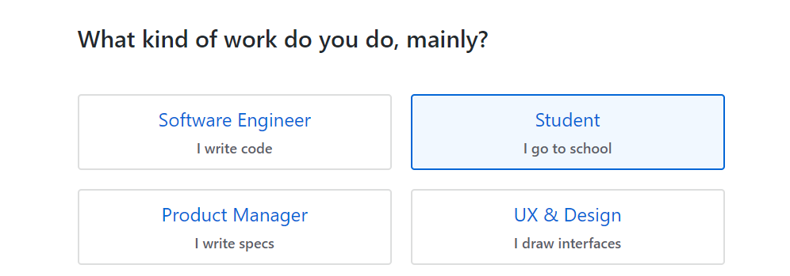
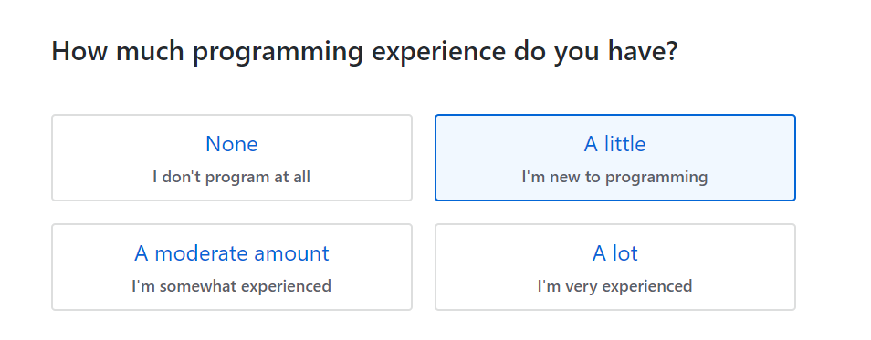
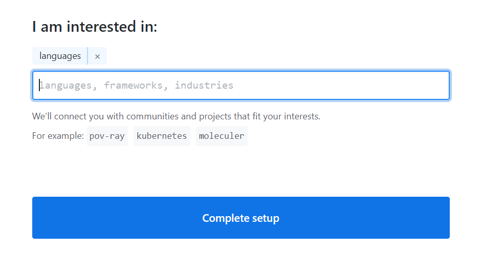

# Intro_to_Git_Workshop

## Staging, Committing and pushing Changes

The ```git add``` command is used to add changes in the working directory to the staging area. It is used to tell Git that you would like to include updates to a particular file in the next commit. However, ```git add``` does not actually record any change until you run the ```git commit```command

Let us take a closer look on how these commands actually works!

First, you need to edit your files in your working directory. Once you have done that and you are ready to save a copy of your project, you stage the changes using the ```git add``` command. Once you are happy with this staged snapshot, you can commit it to the project history using ```git commit```. The ```git reset``` command can be used to undo a commit or a staged snapshot.

In a Git project timeline, commits are like the core building blocks! They can be thought of as milestones along the timeline of a Git project. Git snapshots are always committed to the local repository. Each developer's local repository acts as the buffer between their contributions and the central repository. 

<div style="text-align:center"></div>

Here are some common options:

```bash
git add <file>
```
this allows you to stage all changes in your file for the next commit 
  
```bash
git add <directory>
```
this allows you to stage all changes in your directory for the next commit 

```bash
git add -p
```
  1. Use y to stage a specific portion 
  2. Use n to ignore a specific portion 
  3. Use s to divide the portion into smaller parts
  4. Use e to edit the portion manually 
  5. Use q to exit the interactive session 
  
```bash
git commit 
```
this allows you to commit the staged snapshot. Once this command is run you will be prompted to type in the description of the commit using a text editor

```bash
git commit -a
```
this allows you to commit a snapshot of the changes done in the whole working directory

```bash
git commit -m "<message>"
```
this allows you set the description along with the commit function 

```bash
git commit -am "<message>"
```
this command allows you to combine the -a and the -m options 

we will now see how you can use these commands to commit the changes you made to your personal blog!
  

## Viewing the committed History

The ```git log``` command shows you all the committed snapshots. It is used to list and filter the project history and to search for any particular changes

The log output can be personalized differently by allowing you to filter commits and to display them in an entirely user-defined format

<div style="text-align:center"></div>

```bash 
git log
```
this command allows you to view the entire commit history. It uses space for scrolling and q for exiting if the log output takes up multiple screens

```bash
git log -<n>
```
this command allows you to limit the number of commits displayed to n most recent ones

```bash
git log --oneline
```
this command allows you to fit each commit into a single line, which comes in handy when you would like to get an overview of the project history

```bash
git log --author <name>
git log --committer <name>
```
these commands allows you to filter all commits by either the person who wrote or committed the change

```bash
git log --before <date>
git log --after <date>
git log --after <date> --before <date>
```
these commands allows you to filter all commits by date range

these are just some of the most commonly used commands, to see the full list of available formatting options use the ```git help log``` command to see the man page for the Git Log tool. Alternatively you could view the [online documentation](https://git-scm.com/book/en/v2/Git-Basics-Viewing-the-Commit-History) here!

## Removing a File

As your project changes over time, there will be times when you would have to remove a file or an entire directory from a repository. Git has a special command to remove files, which also takes some important flags depending on your use-case!

Let us now take a look at the ```git rm``` command and how it can be used to remove files and directories from your repository!

```bash
git rm <filename>
```
this command can be used to remove a single file from the repository

```bash
git rm <filename1> <filename2>
```
this command can be used to remove multiple files

```bash
git rm -r <directory>
```
this command can be used to remove an entire directory from the repository 

However we are not quite done yet! If you run the ```status``` command you will notice that the removal of the file is still in staging and needs to be committed to the repository. 

## Creating a GitHub account

Step 1: Go to [this page](https://github.com/join) in any web browser

Step 2: Enter all your personal details: your desired username, email Id and Password and hit "Sign up for GitHub"
<div style="text-align:center"></div>

Step 3: Click the Complete any CAPTCHA puzzle you are asked to complete and hit "Join a Free Plan"
<div style="text-align:center"></div>

Step 4: Select all your preferences 
<div style="text-align:center"></div>
<div style="text-align:center"></div>
<div style="text-align:center"></div>
<div style="text-align:center"></div>

Step 5: Verify your email address 
<div style="text-align:center"></div>

Step 6: Skip any other step for now

## Creating a Repository on GitHub

Step 1: On the upper right corner of any page on the GitHub website, click the "+" icon and then click the option that says "New Repository

<div style="text-align:center"></div>

Step 2: Type in the name and the optional description for the new repository 

Step 3: Choose whether you would like to make this repository a public or a private one. Let us choose the private option for now

Step 4: You can choose to initialise your repository with a README file, which is essentially a document that describes your project. Let us go ahead and do this for now!

<div style="text-align:center"></div>


